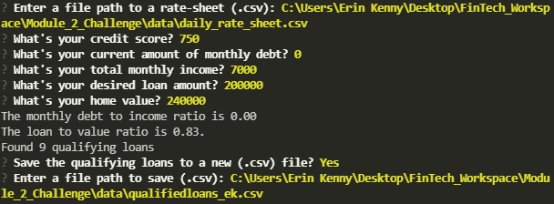
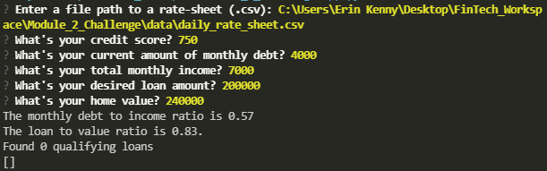

# 2: Financial Applications with Pandas - Loan Qualifier Application
FinTech Boot Camp Module 2 Challenge

---

The purpose of the loan qualifier application was always to filter through a list of avaiable lenders, depending on the applicant's individual finances and lenders' qualification requirements. The original prompts and responses from the program remain as they were:

* Inputting a file path to the loan rate-sheet (.csv)
* Answering the 5 financial information questions
* Returns the debt-to-income ratio
* Returns the loan-to-value ratio
* Returns the number of qualifying loans

Now, the user has the ability to save the qualifying loans to a CSV file and share the results as a spreadsheet. This most recent upgrade to the application's program will prompt the user to save this list of qualifying loans as a new .csv file. The user will also be prompted to input the file path under which they would like the new .csv file to be saved to.

---

## Technologies

This application was written in Python 3.9.4 on a Windows 10 OS.

Libraries used:

* [fire](https://github.com/google/python-fire) - For the command line interface, help page, and entrypoint.

* [questionary](https://github.com/tmbo/questionary) - For interactive user prompts and dialogs.

---

## Installation Guide

Before running the application, install the following dependencies through GitBash or Terminal. 

```python
  pip install fire
  pip install questionary
```

To confirm that the dependencies were installed correctly, check their status with your terminal of choice by entering the following command. This will print a complete list of all external libraries installed locally, among which should be *fire* and *questionary.*

```python
  pip freeze
```

---

## Usage

To use the loan qualifier application, clone the repository and run the **app.py** file with this GitBash or Terminal command:

```python
python app.py
```

Upon launching the loan qualifier application you will be greeted with the following prompts (white). The yellow text indicates sample user input. Each question populates after the user inputs the previous question's information. **No $ dollar symbols** are allowed for numerical input, only integers and floats.

### **Sample prompts: white**
### **User input: yellow** 

***Qualifying loans saved to new .csv file:***



***No qualifying loans found based on input, no new .csv file to save:***



---

## Contributors

Brought to you by E. Kenny for the Business Operations (BizOps) team at ET Home Loans.

ekenny3@uncc.edu

https://www.linkedin.com/in/erin-kenny-56838b164/

---

## License

MIT

License file included in repository.
